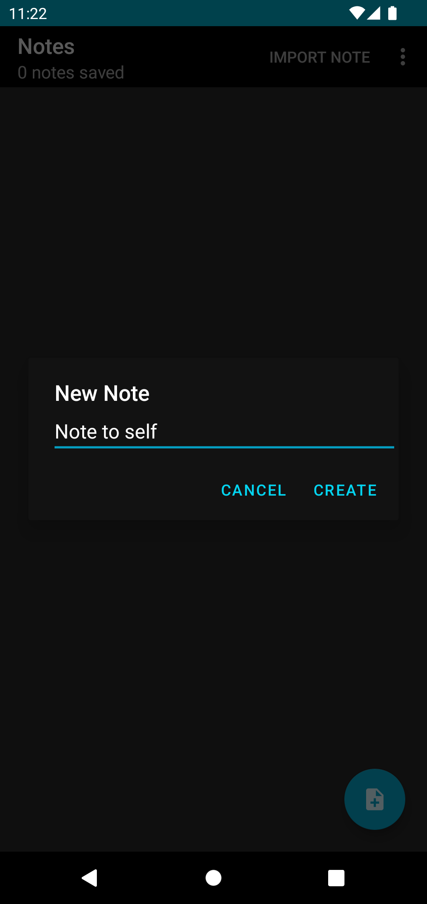

<h2 align="center"><b>Notes</b></h2>
<h4 align="center">A modern and beautiful Android 5.0+ app to write down notes!</h4>

## Screenshots

## Description

Notes saves all the notes you need to a local database, but if needed you can import and export notes (as text files) to your file system.

## License

Notes is licensed under the MIT license. A copy of the license is included in [LICENSE](LICENSE) or you can visit [here](https://digital-construction.mit-license.org/).